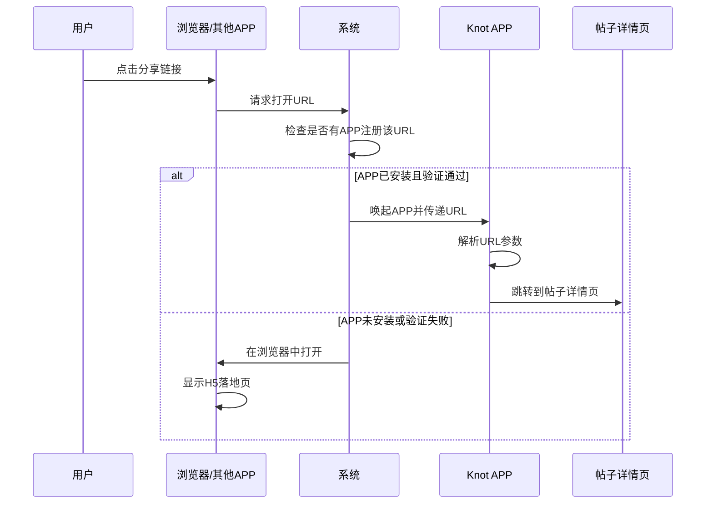
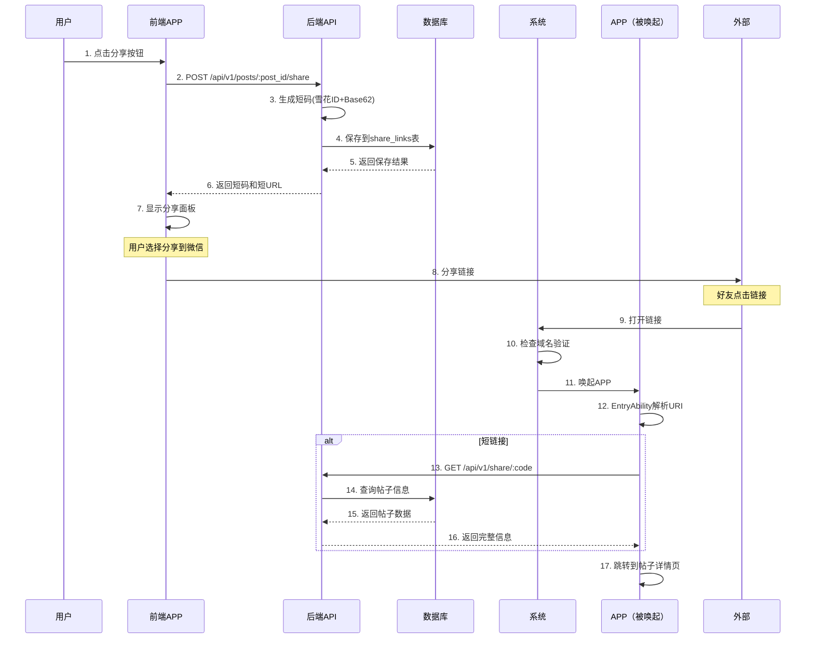

# Deep Link配置使用教程 - 鸿蒙开发指南

**文档编号**: [111]  
**创建时间**: 2025-10-14  
**项目**: Knot - 图片分享社交平台  
**版本**: v1.0.0  
**目标读者**: 鸿蒙前端开发者  
**依赖**: [109]阶段D-3-分享系统实现计划  

---

## 📋 目录

1. [Deep Link原理](#deep-link原理)
2. [鸿蒙两种实现方案对比](#鸿蒙两种实现方案对比)
3. [方案一：自定义Scheme Deep Linking](#方案一自定义scheme-deep-linking)
4. [方案二：App Linking（域名验证）](#方案二app-linking域名验证)
5. [前后端联调流程](#前后端联调流程)
6. [完整示例代码](#完整示例代码)
7. [测试与调试](#测试与调试)
8. [常见问题与排查](#常见问题与排查)
9. [最佳实践](#最佳实践)

---

## Deep Link原理

### 什么是Deep Link

Deep Link（深度链接）是一种通过URL直接打开APP内部特定页面的技术，而不是打开浏览器或APP首页。

**核心价值**：
- 🎯 **无缝体验**：用户点击分享链接直接跳转到内容页面
- 📈 **提升转化**：减少用户操作步骤，提高安装和留存率
- 🔗 **内容传播**：让分享的内容可以直接在APP中查看

### 工作原理



### 两种主流形态

#### 1. 自定义Scheme Deep Linking

**URL格式**：`knot://post/12345`

**特点**：
- ✅ 实施简单，无需服务器配置
- ✅ 适合开发调试和MVP验证
- ⚠️ 需要用户确认打开应用
- ⚠️ 未安装APP会显示错误

**工作流程**：
```
用户点击 knot://post/12345
    ↓
系统检查是否有APP注册 knot:// 协议
    ↓
找到Knot APP → 弹出确认框 → 唤起APP
未找到 → 显示"无法打开链接"错误
```

#### 2. 域名验证类（App Linking）

**URL格式**：`https://knot.app/s/ABC12345`

**特点**：
- ✅ 用户体验最佳，无需确认
- ✅ 未安装APP时在浏览器中打开H5页面
- ✅ 与iOS/Android方案一致
- ⚠️ 需要服务器配置验证文件
- ⚠️ 需要在AGC控制台配置

**工作流程**：
```
用户点击 https://knot.app/s/ABC12345
    ↓
系统下载并验证 /.well-known/applinking.json
    ↓
验证通过 → 直接唤起Knot APP（无确认框）
验证失败或未安装 → 在浏览器中打开H5页面
```

---

## 鸿蒙两种实现方案对比

| 维度 | 自定义Scheme | App Linking |
|------|-------------|-------------|
| **URL格式** | `knot://post/12345` | `https://knot.app/s/ABC12345` |
| **实施难度** | ⭐⭐ 简单 | ⭐⭐⭐⭐ 复杂 |
| **服务器配置** | ❌ 不需要 | ✅ 需要 |
| **域名验证** | ❌ 不需要 | ✅ 需要 |
| **用户体验** | ⚠️ 需要确认 | ✅ 无缝唤起 |
| **未安装时** | ❌ 显示错误 | ✅ 打开H5页面 |
| **安全性** | ⭐⭐ 较低 | ⭐⭐⭐⭐⭐ 高 |
| **适用场景** | 开发调试、MVP | 生产环境 |
| **推荐度** | ⭐⭐⭐ | ⭐⭐⭐⭐⭐ |

### 开发建议

**阶段一：开发期（使用自定义Scheme）**
- 快速接入，无需等待服务器配置
- 方便本地调试和联调
- 可以先验证业务逻辑

**阶段二：测试期（同时支持两种方案）**
- 保留自定义Scheme用于内部测试
- 配置App Linking准备上线
- 进行真机测试和验证

**阶段三：生产期（主推App Linking）**
- 对外分享使用App Linking（https链接）
- 保留自定义Scheme作为降级方案
- 监控唤起成功率和用户体验

---

## 方案一：自定义Scheme Deep Linking

### 步骤1：配置module.json5

打开 `entry/src/main/module.json5` 文件，在 `abilities` 中添加 Deep Link 配置：

```json5
{
  "module": {
    "name": "entry",
    "type": "entry",
    "description": "Knot图片分享应用",
    "mainElement": "EntryAbility",
    "deviceTypes": [
      "phone",
      "tablet"
    ],
    "abilities": [
      {
        "name": "EntryAbility",
        "srcEntry": "./ets/entryability/EntryAbility.ets",
        "description": "应用主入口",
        "icon": "$media:icon",
        "label": "$string:EntryAbility_label",
        "startWindowIcon": "$media:icon",
        "startWindowBackground": "$color:start_window_background",
        "exported": true,
        "skills": [
          {
            // 启动器配置（保留原有）
            "entities": [
              "entity.system.home"
            ],
            "actions": [
              "action.system.home"
            ]
          },
          {
            // ========== Deep Link配置 ==========
            "entities": [
              "entity.system.browsable"  // 允许从浏览器等外部应用唤起
            ],
            "actions": [
              "ohos.want.action.viewData"
            ],
            "uris": [
              {
                "scheme": "knot",        // 自定义协议名称
                "host": "post",          // 帖子详情：knot://post/12345
                "pathStartWith": "/"     // 路径以/开头
              },
              {
                "scheme": "knot",
                "host": "share",         // 短链接解析：knot://share/ABC12345
                "pathStartWith": "/"
              }
            ]
          }
        ]
      }
    ]
  }
}
```

**配置说明**：

| 字段 | 值 | 说明 |
|------|-----|------|
| `scheme` | `"knot"` | 自定义协议名称，建议使用应用名称 |
| `host` | `"post"` / `"share"` | 用于区分不同的业务场景 |
| `pathStartWith` | `"/"` | 路径匹配规则 |
| `entity.system.browsable` | - | 允许从外部应用唤起 |
| `ohos.want.action.viewData` | - | 处理查看数据的意图 |

**支持的URL格式**：
- `knot://post/12345` - 直接跳转到帖子详情页
- `knot://post?id=12345` - 带query参数的方式
- `knot://share/ABC12345` - 短链接解析（先调用后端API，再跳转）

### 步骤2：在EntryAbility中处理Deep Link

打开 `entry/src/main/ets/entryability/EntryAbility.ets` 文件：

```typescript
import UIAbility from '@ohos.app.ability.UIAbility';
import AbilityConstant from '@ohos.app.ability.AbilityConstant';
import Want from '@ohos.app.ability.Want';
import window from '@ohos.window';
import hilog from '@ohos.hilog';
import router from '@ohos.router';

const TAG: string = 'EntryAbility';
const DOMAIN: number = 0xFF00;

export default class EntryAbility extends UIAbility {
  
  onCreate(want: Want, launchParam: AbilityConstant.LaunchParam): void {
    hilog.info(DOMAIN, TAG, 'Ability onCreate');
    
    // 处理Deep Link
    this.handleDeepLink(want);
  }

  onNewWant(want: Want, launchParam: AbilityConstant.LaunchParam): void {
    hilog.info(DOMAIN, TAG, 'Ability onNewWant');
    
    // 当应用已在后台时，通过Deep Link再次唤起
    this.handleDeepLink(want);
  }

  /**
   * 处理Deep Link
   * @param want Want对象，包含URI信息
   */
  private handleDeepLink(want: Want): void {
    // 获取URI
    const uri = want.uri;
    if (!uri) {
      hilog.info(DOMAIN, TAG, 'No URI found');
      return;
    }

    hilog.info(DOMAIN, TAG, `Received Deep Link: ${uri}`);

    try {
      // 解析URI: knot://post/12345 或 knot://share/ABC12345
      const url = new URL(uri);
      const scheme = url.protocol.replace(':', ''); // knot
      const host = url.hostname;                     // post 或 share
      const path = url.pathname;                     // /12345 或 /ABC12345

      if (scheme === 'knot') {
        if (host === 'post') {
          // 场景1：直接跳转帖子详情
          // URL: knot://post/12345
          const postId = path.substring(1); // 去掉开头的"/"
          this.navigateToPostDetail(postId);
          
        } else if (host === 'share') {
          // 场景2：解析短链接
          // URL: knot://share/ABC12345
          const shortCode = path.substring(1);
          this.handleShortLink(shortCode);
        }
      }
    } catch (error) {
      hilog.error(DOMAIN, TAG, `Failed to parse URI: ${error.message}`);
    }
  }

  /**
   * 跳转到帖子详情页
   * @param postId 帖子ID（可能是业务ID或物理ID）
   */
  private navigateToPostDetail(postId: string): void {
    hilog.info(DOMAIN, TAG, `Navigating to post: ${postId}`);

    // 方式1: 使用AppStorage存储参数（推荐）
    AppStorage.SetOrCreate('deeplink_post_id', postId);
    AppStorage.SetOrCreate('deeplink_trigger', Date.now()); // 触发标记

    // 方式2: 使用Router传参（需要在页面中处理）
    // 注意：这里需要在windowStage加载完成后才能使用router
    // 建议在onWindowStageCreate中监听AppStorage变化
  }

  /**
   * 处理短链接
   * @param shortCode 短码（如：ABC12345）
   */
  private async handleShortLink(shortCode: string): Promise<void> {
    hilog.info(DOMAIN, TAG, `Resolving short link: ${shortCode}`);

    try {
      // 调用后端API解析短码
      // GET https://knot.app/api/v1/share/:code
      const response = await fetch(`http://43.142.157.145:8080/api/v1/share/${shortCode}`);
      const data = await response.json();

      if (data.success && data.data.post) {
        // 解析成功，获取帖子ID
        const postId = data.data.post.post_id;
        this.navigateToPostDetail(postId);
      } else {
        hilog.error(DOMAIN, TAG, `Failed to resolve short link: ${data.message}`);
        // TODO: 显示错误提示
      }
    } catch (error) {
      hilog.error(DOMAIN, TAG, `Error resolving short link: ${error.message}`);
      // TODO: 显示网络错误提示
    }
  }

  onDestroy(): void {
    hilog.info(DOMAIN, TAG, 'Ability onDestroy');
  }

  onWindowStageCreate(windowStage: window.WindowStage): void {
    hilog.info(DOMAIN, TAG, 'Ability onWindowStageCreate');

    windowStage.loadContent('pages/Index', (err, data) => {
      if (err.code) {
        hilog.error(DOMAIN, TAG, 'Failed to load the content. Cause: %{public}s', JSON.stringify(err) ?? '');
        return;
      }
      hilog.info(DOMAIN, TAG, 'Succeeded in loading the content. Data: %{public}s', JSON.stringify(data) ?? '');
    });
  }

  onWindowStageDestroy(): void {
    hilog.info(DOMAIN, TAG, 'Ability onWindowStageDestroy');
  }

  onForeground(): void {
    hilog.info(DOMAIN, TAG, 'Ability onForeground');
  }

  onBackground(): void {
    hilog.info(DOMAIN, TAG, 'Ability onBackground');
  }
}
```

### 步骤3：在页面中获取Deep Link参数

在首页（`pages/Index.ets`）或帖子详情页中，获取Deep Link传递的参数：

```typescript
import router from '@ohos.router';
import hilog from '@ohos.hilog';

const TAG = 'IndexPage';
const DOMAIN = 0xFF00;

@Entry
@Component
struct Index {
  @State postId: string = '';
  @StorageLink('deeplink_post_id') deeplinkPostId: string = '';
  @StorageLink('deeplink_trigger') deeplinkTrigger: number = 0;

  aboutToAppear() {
    // 监听Deep Link参数变化
    this.watchDeepLink();
  }

  /**
   * 监听Deep Link参数
   */
  watchDeepLink() {
    // 当deeplinkTrigger变化时，说明有新的Deep Link
    if (this.deeplinkPostId && this.deeplinkTrigger > 0) {
      hilog.info(DOMAIN, TAG, `Deep Link detected: ${this.deeplinkPostId}`);
      
      // 跳转到帖子详情页
      this.navigateToPostDetail(this.deeplinkPostId);
      
      // 清除标记，避免重复触发
      AppStorage.Delete('deeplink_post_id');
      AppStorage.Delete('deeplink_trigger');
    }
  }

  /**
   * 跳转到帖子详情页
   */
  navigateToPostDetail(postId: string) {
    router.pushUrl({
      url: 'pages/PostDetail',
      params: {
        postId: postId
      }
    }).catch((err) => {
      hilog.error(DOMAIN, TAG, `Failed to navigate: ${err.message}`);
    });
  }

  build() {
    Column() {
      Text('Knot - 图片分享')
        .fontSize(24)
        .fontWeight(FontWeight.Bold)
      
      // 其他UI组件...
    }
    .width('100%')
    .height('100%')
  }
}
```

### 步骤4：前端生成Deep Link

在需要分享的地方，调用后端API生成短链接，然后构造Deep Link：

```typescript
/**
 * 调用后端API创建分享链接
 */
async function createShareLink(postId: string, token: string): Promise<{ shortCode: string; shortUrl: string }> {
  const response = await fetch(`http://43.142.157.145:8080/api/v1/posts/${postId}/share`, {
    method: 'POST',
    headers: {
      'Authorization': `Bearer ${token}`,
      'Content-Type': 'application/json'
    }
  });

  const data = await response.json();
  
  if (!data.success) {
    throw new Error(data.message || '创建分享链接失败');
  }

  return {
    shortCode: data.data.short_code,
    shortUrl: data.data.short_url
  };
}

/**
 * 构造自定义Scheme Deep Link
 */
function buildSchemeDeepLink(shortCode: string): string {
  return `knot://share/${shortCode}`;
}

/**
 * 完整的分享流程
 */
async function sharePost(postId: string, token: string) {
  try {
    // 1. 调用后端创建短链接
    const { shortCode, shortUrl } = await createShareLink(postId, token);
    
    // 2. 构造Deep Link
    const deepLink = buildSchemeDeepLink(shortCode);
    
    // 3. 显示分享面板或复制链接
    console.log('Deep Link:', deepLink);
    console.log('Short URL:', shortUrl);
    
    // TODO: 调用系统分享面板或复制到剪贴板
    
  } catch (error) {
    console.error('分享失败:', error.message);
  }
}
```

### 步骤5：测试Deep Link

#### 方法1：命令行测试（推荐）

```bash
# 测试帖子详情Deep Link
hdc shell aa start -U "knot://post/12345" -b com.knot.app -a EntryAbility

# 测试短链接Deep Link
hdc shell aa start -U "knot://share/ABC12345" -b com.knot.app -a EntryAbility
```

**参数说明**：
- `-U`: URI参数
- `-b`: 应用包名（Bundle Name）
- `-a`: Ability名称

#### 方法2：真机测试

1. 通过短信、备忘录等应用发送链接：`knot://post/12345`
2. 点击链接
3. 系统弹出确认框："是否打开Knot应用?"
4. 点击确认，应用打开并跳转到帖子详情页

#### 方法3：H5页面测试

创建一个测试HTML文件：

```html
<!DOCTYPE html>
<html>
<head>
    <meta charset="UTF-8">
    <title>Deep Link测试</title>
</head>
<body>
    <h1>Knot Deep Link测试</h1>
    
    <button onclick="openApp('knot://post/12345')">
        打开帖子详情（ID: 12345）
    </button>
    
    <button onclick="openApp('knot://share/ABC12345')">
        打开短链接（Code: ABC12345）
    </button>

    <script>
        function openApp(url) {
            window.location.href = url;
            
            // 如果3秒后还在页面，说明应用未安装
            setTimeout(function() {
                if (document.hidden === false) {
                    alert('请先安装Knot应用');
                }
            }, 3000);
        }
    </script>
</body>
</html>
```

---

## 方案二：App Linking（域名验证）

### 步骤1：服务器配置

#### 1.1 创建applinking.json文件

在服务器创建文件：`https://knot.app/.well-known/applinking.json`

```json
{
  "relation": ["delegate_permission/common.handle_all_urls"],
  "target": {
    "namespace": "harmony_app",
    "bundle_name": "com.knot.app",
    "sha256_cert_fingerprints": [
      "AA:BB:CC:DD:EE:FF:00:11:22:33:44:55:66:77:88:99:AA:BB:CC:DD:EE:FF:00:11:22:33:44:55:66:77:88:99"
    ]
  }
}
```

**字段说明**：

| 字段 | 说明 | 如何获取 |
|------|------|---------|
| `bundle_name` | 应用包名 | 在`app.json5`中查看 |
| `sha256_cert_fingerprints` | 签名证书SHA256指纹 | 见下方获取方法 |

#### 1.2 获取证书SHA256指纹

**在DevEco Studio中获取**：

1. 打开 `File` → `Project Structure` → `Signing Configs`
2. 选择你的签名配置（如：default）
3. 复制 `SHA256` 值

**使用命令行获取**：

```bash
# 查看.p12证书文件
keytool -list -v -keystore /path/to/your.p12 -storetype PKCS12

# 输出示例：
# 证书指纹:
#   SHA256: AA:BB:CC:DD:EE:FF:00:11:22:33:44:55:66:77:88:99:AA:BB:CC:DD:EE:FF:00:11:22:33:44:55:66:77:88:99
```

**注意事项**：
- Debug版本和Release版本的证书指纹不同
- 建议在 `sha256_cert_fingerprints` 数组中同时添加Debug和Release证书
- 证书指纹格式必须是大写字母，用冒号分隔

#### 1.3 配置Nginx

编辑Nginx配置文件：

```nginx
server {
    listen 443 ssl http2;
    server_name knot.app;

    # SSL证书配置
    ssl_certificate /etc/nginx/ssl/knot.app.crt;
    ssl_certificate_key /etc/nginx/ssl/knot.app.key;

    # HarmonyOS App Linking配置
    location /.well-known/applinking.json {
        alias /usr/share/nginx/html/.well-known/applinking.json;
        default_type application/json;
        add_header Access-Control-Allow-Origin *;
        add_header Content-Type "application/json; charset=utf-8";
    }

    # API代理
    location /api/ {
        proxy_pass http://localhost:8080;
        proxy_set_header Host $host;
        proxy_set_header X-Real-IP $remote_addr;
        proxy_set_header X-Forwarded-For $proxy_add_x_forwarded_for;
    }
}
```

重启Nginx：

```bash
sudo systemctl reload nginx
```

#### 1.4 验证配置

在浏览器访问：`https://knot.app/.well-known/applinking.json`

应该看到JSON内容，且Content-Type为 `application/json`。

### 步骤2：配置module.json5

打开 `entry/src/main/module.json5` 文件：

```json5
{
  "module": {
    "name": "entry",
    "type": "entry",
    "description": "Knot图片分享应用",
    "mainElement": "EntryAbility",
    "deviceTypes": [
      "phone",
      "tablet"
    ],
    "abilities": [
      {
        "name": "EntryAbility",
        "srcEntry": "./ets/entryability/EntryAbility.ets",
        "description": "应用主入口",
        "icon": "$media:icon",
        "label": "$string:EntryAbility_label",
        "startWindowIcon": "$media:icon",
        "startWindowBackground": "$color:start_window_background",
        "exported": true,
        "skills": [
          {
            "entities": [
              "entity.system.home"
            ],
            "actions": [
              "action.system.home"
            ]
          },
          {
            // ========== App Linking配置 ==========
            "entities": [
              "entity.system.browsable"
            ],
            "actions": [
              "ohos.want.action.viewData"
            ],
            "uris": [
              {
                "scheme": "https",           // 必须是https
                "host": "knot.app",          // 你的域名
                "pathStartWith": "/s/",      // 匹配 /s/* 路径
                "domainVerify": true         // ⭐ 启用域名验证
              },
              {
                "scheme": "https",
                "host": "knot.app",
                "pathStartWith": "/post/",   // 匹配 /post/* 路径
                "domainVerify": true         // ⭐ 启用域名验证
              }
            ]
          }
        ]
      }
    ]
  }
}
```

**关键配置说明**：

| 字段 | 值 | 说明 |
|------|-----|------|
| `scheme` | `"https"` | 必须使用https（不支持http） |
| `host` | `"knot.app"` | 你的域名 |
| `pathStartWith` | `"/s/"` | 路径前缀，匹配 `/s/ABC12345` |
| `domainVerify` | `true` | **启用域名验证**（这是App Linking的核心） |

**支持的URL格式**：
- `https://knot.app/s/ABC12345` - 短链接
- `https://knot.app/post/12345` - 帖子详情

### 步骤3：在EntryAbility中处理App Linking

处理代码与自定义Scheme类似，只需要解析HTTPS URL：

```typescript
import UIAbility from '@ohos.app.ability.UIAbility';
import AbilityConstant from '@ohos.app.ability.AbilityConstant';
import Want from '@ohos.app.ability.Want';
import window from '@ohos.window';
import hilog from '@ohos.hilog';

const TAG: string = 'EntryAbility';
const DOMAIN: number = 0xFF00;

export default class EntryAbility extends UIAbility {
  
  onCreate(want: Want, launchParam: AbilityConstant.LaunchParam): void {
    hilog.info(DOMAIN, TAG, 'Ability onCreate');
    this.handleAppLinking(want);
  }

  onNewWant(want: Want, launchParam: AbilityConstant.LaunchParam): void {
    hilog.info(DOMAIN, TAG, 'Ability onNewWant');
    this.handleAppLinking(want);
  }

  /**
   * 处理App Linking
   * @param want Want对象，包含URI信息
   */
  private handleAppLinking(want: Want): void {
    const uri = want.uri;
    if (!uri) {
      hilog.info(DOMAIN, TAG, 'No URI found');
      return;
    }

    hilog.info(DOMAIN, TAG, `Received App Linking: ${uri}`);

    try {
      // 解析URI: https://knot.app/s/ABC12345 或 https://knot.app/post/12345
      const url = new URL(uri);
      const host = url.hostname;  // knot.app
      const path = url.pathname;  // /s/ABC12345 或 /post/12345

      if (host === 'knot.app') {
        if (path.startsWith('/s/')) {
          // 短链接: /s/ABC12345
          const shortCode = path.substring(3); // 去掉"/s/"
          this.handleShortLink(shortCode);
          
        } else if (path.startsWith('/post/')) {
          // 帖子详情: /post/12345
          const postId = path.substring(6); // 去掉"/post/"
          this.navigateToPostDetail(postId);
        }
      }
    } catch (error) {
      hilog.error(DOMAIN, TAG, `Failed to parse URI: ${error.message}`);
    }
  }

  private navigateToPostDetail(postId: string): void {
    hilog.info(DOMAIN, TAG, `Navigating to post: ${postId}`);
    AppStorage.SetOrCreate('deeplink_post_id', postId);
    AppStorage.SetOrCreate('deeplink_trigger', Date.now());
  }

  private async handleShortLink(shortCode: string): Promise<void> {
    hilog.info(DOMAIN, TAG, `Resolving short link: ${shortCode}`);

    try {
      // 调用后端API解析短码
      const response = await fetch(`https://knot.app/api/v1/share/${shortCode}`);
      const data = await response.json();

      if (data.success && data.data.post) {
        const postId = data.data.post.post_id;
        this.navigateToPostDetail(postId);
      } else {
        hilog.error(DOMAIN, TAG, `Failed to resolve short link: ${data.message}`);
      }
    } catch (error) {
      hilog.error(DOMAIN, TAG, `Error resolving short link: ${error.message}`);
    }
  }

  // ... 其他生命周期方法保持不变
}
```

### 步骤4：在AGC控制台配置（重要）

1. 登录 [AppGallery Connect](https://developer.huawei.com/consumer/cn/service/josp/agc/index.html)
2. 选择你的项目
3. 进入 `我的应用` → 选择你的应用
4. 点击 `服务` → `App Linking`
5. 点击 `添加域名`
6. 输入域名：`knot.app`
7. 点击 `保存`

**验证方法**：
AGC会自动下载并验证你的 `applinking.json` 文件，确保：
- 文件可通过HTTPS访问
- `bundle_name` 与应用包名一致
- `sha256_cert_fingerprints` 包含应用签名证书

### 步骤5：前端生成App Linking URL

```typescript
/**
 * 构造App Linking URL（直接使用后端返回的短URL）
 */
function buildAppLinkingUrl(shortUrlFromServer: string): string {
  // 短URL本身就是App Linking入口
  // 例如：https://knot.app/s/ABC12345
  return shortUrlFromServer;
}

/**
 * 完整的分享流程（App Linking版本）
 */
async function sharePostWithAppLinking(postId: string, token: string) {
  try {
    // 1. 调用后端创建短链接
    const { shortCode, shortUrl } = await createShareLink(postId, token);
    
    // 2. 直接使用短URL（已经是App Linking格式）
    const appLinkingUrl = buildAppLinkingUrl(shortUrl);
    
    // 3. 显示分享面板或复制链接
    console.log('App Linking URL:', appLinkingUrl);
    
    // TODO: 调用系统分享面板
    
  } catch (error) {
    console.error('分享失败:', error.message);
  }
}
```

### 步骤6：测试App Linking

#### 方法1：命令行测试

```bash
# 测试App Linking
hdc shell aa start -U "https://knot.app/s/ABC12345" -b com.knot.app -a EntryAbility

# 测试帖子详情
hdc shell aa start -U "https://knot.app/post/12345" -b com.knot.app -a EntryAbility
```

#### 方法2：真机测试（推荐）

1. 通过短信、备忘录等应用发送链接：`https://knot.app/s/ABC12345`
2. 点击链接
3. 应该**直接唤起应用**（无需确认）
4. 如果未安装应用，在浏览器中打开H5页面

#### 方法3：验证域名验证状态

在DevEco Studio的终端中运行：

```bash
# 检查App Linking验证状态
hdc shell bm dump -n com.knot.app

# 输出中查找:
# domainVerify: verified (表示验证成功)
```

---

## 前后端联调流程

### 完整流程图



### 步骤1：前端调用后端创建短链接

```typescript
/**
 * 创建分享链接
 * @param postId 帖子业务ID（如：POST_2025Q4_ABC123）
 * @param token JWT访问令牌
 */
async function createShareLink(postId: string, token: string): Promise<ShareLinkResult> {
  const response = await fetch(`http://43.142.157.145:8080/api/v1/posts/${postId}/share`, {
    method: 'POST',
    headers: {
      'Authorization': `Bearer ${token}`,
      'Content-Type': 'application/json'
    }
  });

  const data = await response.json();
  
  if (!data.success) {
    throw new Error(data.message || '创建分享链接失败');
  }

  return {
    shortCode: data.data.short_code,        // 短码：ABC12345
    shortUrl: data.data.short_url,          // 短URL：http://43.142.157.145:8080/s/ABC12345
    postId: data.data.post_id,              // 帖子ID
    createTime: data.data.create_time,      // 创建时间
    expireTime: data.data.expire_time       // 过期时间（null表示永久）
  };
}

interface ShareLinkResult {
  shortCode: string;
  shortUrl: string;
  postId: string;
  createTime: number;
  expireTime: number | null;
}
```

### 步骤2：构造Deep Link

```typescript
/**
 * 构造Deep Link（根据环境选择）
 */
function buildDeepLink(shortCode: string, shortUrl: string, useAppLinking: boolean = true): string {
  if (useAppLinking) {
    // 生产环境：使用App Linking（https链接）
    return shortUrl.replace('http://', 'https://').replace(':8080', '');
    // 结果：https://knot.app/s/ABC12345
  } else {
    // 开发环境：使用自定义Scheme
    return `knot://share/${shortCode}`;
    // 结果：knot://share/ABC12345
  }
}
```

### 步骤3：显示分享面板

```typescript
import pasteboard from '@ohos.pasteboard';
import promptAction from '@ohos.promptAction';

/**
 * 分享帖子
 */
async function sharePost(postId: string, token: string) {
  try {
    // 1. 创建短链接
    const result = await createShareLink(postId, token);
    
    // 2. 构造Deep Link
    const deepLink = buildDeepLink(result.shortCode, result.shortUrl, true);
    
    // 3. 复制到剪贴板
    const pasteboardData = pasteboard.createData(pasteboard.MIMETYPE_TEXT_PLAIN, deepLink);
    const systemPasteboard = pasteboard.getSystemPasteboard();
    await systemPasteboard.setData(pasteboardData);
    
    // 4. 显示提示
    promptAction.showToast({
      message: '链接已复制到剪贴板',
      duration: 2000
    });
    
    // TODO: 显示分享面板，让用户选择分享到哪个平台
    
  } catch (error) {
    promptAction.showToast({
      message: `分享失败: ${error.message}`,
      duration: 2000
    });
  }
}
```

### 步骤4：APP被唤起后解析短链接

```typescript
/**
 * 解析短链接（在EntryAbility中调用）
 */
async function resolveShortLink(shortCode: string): Promise<PostData> {
  const response = await fetch(`http://43.142.157.145:8080/api/v1/share/${shortCode}`);
  const data = await response.json();

  if (!data.success) {
    throw new Error(data.message || '解析短链接失败');
  }

  return data.data.post;
}

interface PostData {
  post_id: string;
  user_id: number;
  title: string;
  description: string;
  image_count: number;
  like_count: number;
  favorite_count: number;
  view_count: number;
  status: string;
  create_time: number;
  update_time: number;
  images: ImageData[];
  user: UserData;
}

interface ImageData {
  image_id: string;
  post_id: number;
  display_order: number;
  file_url: string;
  thumbnail_url: string;
  file_size: number;
  width: number;
  height: number;
  mime_type: string;
  create_time: number;
}

interface UserData {
  user_id: string;
  username: string;
  real_name: string;
  avatar_url: string;
}
```

---

## 完整示例代码

### 示例1：分享按钮组件

```typescript
// ShareButton.ets
import promptAction from '@ohos.promptAction';
import pasteboard from '@ohos.pasteboard';

@Component
export struct ShareButton {
  @Prop postId: string;
  @StorageLink('access_token') token: string = '';

  build() {
    Button('分享')
      .onClick(() => {
        this.handleShare();
      })
  }

  async handleShare() {
    try {
      // 1. 创建短链接
      const result = await this.createShareLink();
      
      // 2. 构造Deep Link
      const deepLink = this.buildDeepLink(result.shortCode, result.shortUrl);
      
      // 3. 显示分享选项
      this.showShareOptions(deepLink);
      
    } catch (error) {
      promptAction.showToast({
        message: `分享失败: ${error.message}`,
        duration: 2000
      });
    }
  }

  async createShareLink(): Promise<{ shortCode: string; shortUrl: string }> {
    const response = await fetch(`http://43.142.157.145:8080/api/v1/posts/${this.postId}/share`, {
      method: 'POST',
      headers: {
        'Authorization': `Bearer ${this.token}`,
        'Content-Type': 'application/json'
      }
    });

    const data = await response.json();
    
    if (!data.success) {
      throw new Error(data.message || '创建分享链接失败');
    }

    return {
      shortCode: data.data.short_code,
      shortUrl: data.data.short_url
    };
  }

  buildDeepLink(shortCode: string, shortUrl: string): string {
    // 生产环境使用App Linking
    return shortUrl.replace('http://', 'https://').replace(':8080', '');
  }

  async showShareOptions(deepLink: string) {
    // 复制到剪贴板
    const pasteboardData = pasteboard.createData(pasteboard.MIMETYPE_TEXT_PLAIN, deepLink);
    const systemPasteboard = pasteboard.getSystemPasteboard();
    await systemPasteboard.setData(pasteboardData);

    promptAction.showToast({
      message: '链接已复制，可以分享到微信、微博等平台',
      duration: 3000
    });

    // TODO: 集成系统分享面板
  }
}
```

### 示例2：帖子详情页（接收Deep Link参数）

```typescript
// PostDetail.ets
import router from '@ohos.router';
import hilog from '@ohos.hilog';

const TAG = 'PostDetail';
const DOMAIN = 0xFF00;

@Entry
@Component
struct PostDetail {
  @State postId: string = '';
  @State postData: PostData | null = null;
  @State loading: boolean = true;

  aboutToAppear() {
    // 获取路由参数
    const params = router.getParams() as { postId?: string };
    if (params?.postId) {
      this.postId = params.postId;
      this.loadPostData();
    }
  }

  async loadPostData() {
    try {
      this.loading = true;
      
      // 调用后端API获取帖子详情
      const response = await fetch(`http://43.142.157.145:8080/api/v1/posts/${this.postId}`);
      const data = await response.json();
      
      if (data.success) {
        this.postData = data.data;
      } else {
        hilog.error(DOMAIN, TAG, `Failed to load post: ${data.message}`);
      }
    } catch (error) {
      hilog.error(DOMAIN, TAG, `Error loading post: ${error.message}`);
    } finally {
      this.loading = false;
    }
  }

  build() {
    Column() {
      if (this.loading) {
        Text('加载中...')
          .fontSize(16)
      } else if (this.postData) {
        // 显示帖子内容
        Text(this.postData.title)
          .fontSize(24)
          .fontWeight(FontWeight.Bold)
        
        Text(this.postData.description)
          .fontSize(16)
          .margin({ top: 10 })
        
        // 显示图片列表
        List() {
          ForEach(this.postData.images, (image: ImageData) => {
            ListItem() {
              Image(image.file_url)
                .width('100%')
                .objectFit(ImageFit.Cover)
            }
          })
        }
        
        // 分享按钮
        ShareButton({ postId: this.postId })
          .margin({ top: 20 })
        
      } else {
        Text('帖子不存在')
          .fontSize(16)
      }
    }
    .width('100%')
    .height('100%')
    .padding(16)
  }
}

interface PostData {
  post_id: string;
  title: string;
  description: string;
  images: ImageData[];
}

interface ImageData {
  image_id: string;
  file_url: string;
  thumbnail_url: string;
}
```

### 示例3：完整的EntryAbility（支持两种方案）

```typescript
// EntryAbility.ets
import UIAbility from '@ohos.app.ability.UIAbility';
import AbilityConstant from '@ohos.app.ability.AbilityConstant';
import Want from '@ohos.app.ability.Want';
import window from '@ohos.window';
import hilog from '@ohos.hilog';

const TAG: string = 'EntryAbility';
const DOMAIN: number = 0xFF00;

export default class EntryAbility extends UIAbility {
  
  onCreate(want: Want, launchParam: AbilityConstant.LaunchParam): void {
    hilog.info(DOMAIN, TAG, 'Ability onCreate');
    this.handleDeepLink(want);
  }

  onNewWant(want: Want, launchParam: AbilityConstant.LaunchParam): void {
    hilog.info(DOMAIN, TAG, 'Ability onNewWant');
    this.handleDeepLink(want);
  }

  /**
   * 统一处理Deep Link（支持自定义Scheme和App Linking）
   */
  private handleDeepLink(want: Want): void {
    const uri = want.uri;
    if (!uri) {
      return;
    }

    hilog.info(DOMAIN, TAG, `Received Deep Link: ${uri}`);

    try {
      const url = new URL(uri);
      const scheme = url.protocol.replace(':', '');
      const host = url.hostname;
      const path = url.pathname;

      // 判断是自定义Scheme还是App Linking
      if (scheme === 'knot') {
        // 自定义Scheme: knot://post/12345 或 knot://share/ABC12345
        this.handleCustomScheme(host, path);
      } else if (scheme === 'https' && host === 'knot.app') {
        // App Linking: https://knot.app/s/ABC12345 或 https://knot.app/post/12345
        this.handleAppLinking(path);
      }
    } catch (error) {
      hilog.error(DOMAIN, TAG, `Failed to parse URI: ${error.message}`);
    }
  }

  /**
   * 处理自定义Scheme
   */
  private handleCustomScheme(host: string, path: string): void {
    if (host === 'post') {
      const postId = path.substring(1);
      this.navigateToPostDetail(postId);
    } else if (host === 'share') {
      const shortCode = path.substring(1);
      this.handleShortLink(shortCode);
    }
  }

  /**
   * 处理App Linking
   */
  private handleAppLinking(path: string): void {
    if (path.startsWith('/s/')) {
      const shortCode = path.substring(3);
      this.handleShortLink(shortCode);
    } else if (path.startsWith('/post/')) {
      const postId = path.substring(6);
      this.navigateToPostDetail(postId);
    }
  }

  /**
   * 跳转到帖子详情页
   */
  private navigateToPostDetail(postId: string): void {
    hilog.info(DOMAIN, TAG, `Navigating to post: ${postId}`);
    AppStorage.SetOrCreate('deeplink_post_id', postId);
    AppStorage.SetOrCreate('deeplink_trigger', Date.now());
  }

  /**
   * 处理短链接
   */
  private async handleShortLink(shortCode: string): Promise<void> {
    hilog.info(DOMAIN, TAG, `Resolving short link: ${shortCode}`);

    try {
      const response = await fetch(`http://43.142.157.145:8080/api/v1/share/${shortCode}`);
      const data = await response.json();

      if (data.success && data.data.post) {
        const postId = data.data.post.post_id;
        this.navigateToPostDetail(postId);
      } else {
        hilog.error(DOMAIN, TAG, `Failed to resolve short link: ${data.message}`);
      }
    } catch (error) {
      hilog.error(DOMAIN, TAG, `Error resolving short link: ${error.message}`);
    }
  }

  onDestroy(): void {
    hilog.info(DOMAIN, TAG, 'Ability onDestroy');
  }

  onWindowStageCreate(windowStage: window.WindowStage): void {
    hilog.info(DOMAIN, TAG, 'Ability onWindowStageCreate');

    windowStage.loadContent('pages/Index', (err, data) => {
      if (err.code) {
        hilog.error(DOMAIN, TAG, 'Failed to load the content. Cause: %{public}s', JSON.stringify(err) ?? '');
        return;
      }
      hilog.info(DOMAIN, TAG, 'Succeeded in loading the content. Data: %{public}s', JSON.stringify(data) ?? '');
    });
  }

  onWindowStageDestroy(): void {
    hilog.info(DOMAIN, TAG, 'Ability onWindowStageDestroy');
  }

  onForeground(): void {
    hilog.info(DOMAIN, TAG, 'Ability onForeground');
  }

  onBackground(): void {
    hilog.info(DOMAIN, TAG, 'Ability onBackground');
  }
}
```

---

## 测试与调试

### 测试清单

| 测试场景 | 测试方法 | 预期结果 |
|---------|---------|---------|
| 自定义Scheme - 帖子详情 | `hdc shell aa start -U "knot://post/12345"` | 直接打开帖子详情页 |
| 自定义Scheme - 短链接 | `hdc shell aa start -U "knot://share/ABC12345"` | 解析短码后打开帖子详情页 |
| App Linking - 短链接 | `hdc shell aa start -U "https://knot.app/s/ABC12345"` | 直接唤起APP并打开帖子详情页 |
| App Linking - 帖子详情 | `hdc shell aa start -U "https://knot.app/post/12345"` | 直接打开帖子详情页 |
| 真机测试 - 短信 | 发送链接到短信，点击 | 唤起APP |
| 真机测试 - 备忘录 | 在备忘录中点击链接 | 唤起APP |
| 未安装APP | 在浏览器中打开链接 | 显示H5落地页 |
| 无效短码 | 使用不存在的短码 | 显示错误提示 |

### 调试技巧

#### 1. 查看日志

```bash
# 实时查看日志
hdc shell hilog | grep EntryAbility

# 过滤Deep Link相关日志
hdc shell hilog | grep "Deep Link"
```

#### 2. 验证域名配置

```bash
# 检查applinking.json是否可访问
curl -I https://knot.app/.well-known/applinking.json

# 应该返回:
# HTTP/2 200
# content-type: application/json
```

#### 3. 检查域名验证状态

```bash
# 查看App Linking验证状态
hdc shell bm dump -n com.knot.app

# 查找输出中的:
# domainVerify: verified (成功)
# domainVerify: failed (失败)
```

#### 4. 测试短链接解析

```bash
# 直接测试后端API
curl http://43.142.157.145:8080/api/v1/share/ABC12345

# 应该返回帖子完整信息
```

### 常见错误排查

| 错误现象 | 可能原因 | 解决方法 |
|---------|---------|---------|
| 点击链接无反应 | module.json5配置错误 | 检查skills配置是否正确 |
| 提示"无法打开链接" | APP未注册该Scheme | 检查scheme配置 |
| 打开浏览器而非APP | 域名验证失败 | 检查applinking.json和证书指纹 |
| APP闪退 | EntryAbility解析错误 | 查看hilog日志 |
| 短码解析失败 | 后端API错误 | 检查网络和API返回 |

---

## 常见问题与排查

### Q1: 为什么点击链接没有唤起APP？

**可能原因**：
1. module.json5配置错误
2. 域名验证失败（App Linking）
3. APP未安装
4. 系统版本不支持

**排查步骤**：
```bash
# 1. 检查配置
cat entry/src/main/module.json5 | grep -A 20 "skills"

# 2. 检查域名验证
curl -I https://knot.app/.well-known/applinking.json

# 3. 检查APP是否安装
hdc shell bm dump -a | grep com.knot.app

# 4. 查看日志
hdc shell hilog | grep EntryAbility
```

### Q2: App Linking域名验证失败怎么办？

**检查清单**：
- [ ] applinking.json文件可通过HTTPS访问
- [ ] Content-Type为application/json
- [ ] bundle_name与应用包名一致
- [ ] 证书指纹正确（大写、冒号分隔）
- [ ] module.json5中domainVerify设为true
- [ ] 在AGC控制台添加了域名

**验证命令**：
```bash
# 验证文件可访问
curl https://knot.app/.well-known/applinking.json

# 验证Content-Type
curl -I https://knot.app/.well-known/applinking.json | grep content-type

# 验证APP域名验证状态
hdc shell bm dump -n com.knot.app | grep domainVerify
```

### Q3: 如何获取证书SHA256指纹？

**方法1：DevEco Studio**
1. `File` → `Project Structure` → `Signing Configs`
2. 选择签名配置
3. 复制SHA256值

**方法2：命令行**
```bash
keytool -list -v -keystore /path/to/your.p12 -storetype PKCS12
```

**注意**：
- Debug和Release证书指纹不同
- 建议都添加到applinking.json中

### Q4: 自定义Scheme和App Linking可以同时使用吗？

**可以！** 建议同时配置：

```json5
"uris": [
  // 自定义Scheme（用于开发调试）
  {
    "scheme": "knot",
    "host": "post",
    "pathStartWith": "/"
  },
  // App Linking（用于生产环境）
  {
    "scheme": "https",
    "host": "knot.app",
    "pathStartWith": "/s/",
    "domainVerify": true
  }
]
```

在EntryAbility中统一处理：
```typescript
private handleDeepLink(want: Want): void {
  const uri = want.uri;
  const url = new URL(uri);
  const scheme = url.protocol.replace(':', '');
  
  if (scheme === 'knot') {
    // 处理自定义Scheme
  } else if (scheme === 'https') {
    // 处理App Linking
  }
}
```

### Q5: 如何在H5页面中唤起APP？

```html
<!DOCTYPE html>
<html>
<head>
    <meta charset="UTF-8">
    <title>Knot - 帖子分享</title>
    <script>
        window.onload = function() {
            const userAgent = navigator.userAgent.toLowerCase();
            const shortCode = 'ABC12345'; // 从URL获取

            if (userAgent.indexOf('harmonyos') !== -1) {
                // HarmonyOS: 优先使用App Linking
                window.location.href = `https://knot.app/s/${shortCode}`;

                // 降级到自定义Scheme
                setTimeout(function() {
                    window.location.href = `knot://share/${shortCode}`;
                }, 500);
            }

            // 2秒后如果还在页面，显示下载提示
            setTimeout(function() {
                if (!document.hidden) {
                    document.getElementById('download-tip').style.display = 'block';
                }
            }, 2000);
        };
    </script>
</head>
<body>
    <h1>正在打开Knot应用...</h1>

    <div id="download-tip" style="display:none;">
        <p>未检测到Knot应用，请先安装</p>
        <a href="https://knot.app/download">下载Knot应用</a>
    </div>

    <!-- 帖子内容预览 -->
    <div id="post-preview">
        <!-- TODO: 显示帖子图片和信息 -->
    </div>
</body>
</html>
```

### Q6: 如何测试Deep Link在不同场景下的表现？

**测试场景矩阵**：

| 场景 | APP状态 | 预期行为 | 测试方法 |
|------|---------|---------|---------|
| 自定义Scheme | 已安装 | 弹出确认框，唤起APP | 命令行测试 |
| 自定义Scheme | 未安装 | 显示错误 | 卸载APP后测试 |
| App Linking | 已安装 | 直接唤起APP | 真机测试 |
| App Linking | 未安装 | 打开H5页面 | 卸载APP后测试 |
| 短信中点击 | 已安装 | 唤起APP | 真机测试 |
| 备忘录中点击 | 已安装 | 唤起APP | 真机测试 |
| 浏览器中打开 | 已安装 | 唤起APP | 浏览器测试 |
| 浏览器中打开 | 未安装 | 显示H5页面 | 浏览器测试 |

---

## 最佳实践

### 1. 开发阶段建议

**阶段一：本地开发（使用自定义Scheme）**
```json5
// module.json5
"uris": [
  {
    "scheme": "knot",
    "host": "post",
    "pathStartWith": "/"
  }
]
```

**优势**：
- 无需服务器配置
- 快速验证业务逻辑
- 方便调试

**阶段二：联调测试（同时支持两种方案）**
```json5
// module.json5
"uris": [
  // 保留自定义Scheme
  {
    "scheme": "knot",
    "host": "post",
    "pathStartWith": "/"
  },
  // 添加App Linking
  {
    "scheme": "https",
    "host": "knot.app",
    "pathStartWith": "/s/",
    "domainVerify": true
  }
]
```

**阶段三：生产环境（主推App Linking）**
- 对外分享使用App Linking
- 保留自定义Scheme作为降级方案

### 2. 代码组织建议

**创建DeepLinkManager工具类**：

```typescript
// utils/DeepLinkManager.ets
export class DeepLinkManager {
  private static instance: DeepLinkManager;

  private constructor() {}

  static getInstance(): DeepLinkManager {
    if (!DeepLinkManager.instance) {
      DeepLinkManager.instance = new DeepLinkManager();
    }
    return DeepLinkManager.instance;
  }

  /**
   * 解析Deep Link URI
   */
  parseUri(uri: string): DeepLinkInfo | null {
    try {
      const url = new URL(uri);
      const scheme = url.protocol.replace(':', '');
      const host = url.hostname;
      const path = url.pathname;

      if (scheme === 'knot') {
        return this.parseCustomScheme(host, path);
      } else if (scheme === 'https' && host === 'knot.app') {
        return this.parseAppLinking(path);
      }
    } catch (error) {
      console.error('Failed to parse URI:', error);
    }
    return null;
  }

  private parseCustomScheme(host: string, path: string): DeepLinkInfo {
    if (host === 'post') {
      return {
        type: 'post',
        postId: path.substring(1)
      };
    } else if (host === 'share') {
      return {
        type: 'share',
        shortCode: path.substring(1)
      };
    }
    return null;
  }

  private parseAppLinking(path: string): DeepLinkInfo {
    if (path.startsWith('/s/')) {
      return {
        type: 'share',
        shortCode: path.substring(3)
      };
    } else if (path.startsWith('/post/')) {
      return {
        type: 'post',
        postId: path.substring(6)
      };
    }
    return null;
  }

  /**
   * 构造Deep Link
   */
  buildDeepLink(type: 'post' | 'share', id: string, useAppLinking: boolean = true): string {
    if (useAppLinking) {
      if (type === 'post') {
        return `https://knot.app/post/${id}`;
      } else {
        return `https://knot.app/s/${id}`;
      }
    } else {
      if (type === 'post') {
        return `knot://post/${id}`;
      } else {
        return `knot://share/${id}`;
      }
    }
  }
}

export interface DeepLinkInfo {
  type: 'post' | 'share';
  postId?: string;
  shortCode?: string;
}
```

### 3. 错误处理建议

```typescript
/**
 * 统一的错误处理
 */
async function handleDeepLinkWithErrorHandling(uri: string) {
  try {
    const deepLinkInfo = DeepLinkManager.getInstance().parseUri(uri);
    
    if (!deepLinkInfo) {
      throw new Error('无效的Deep Link');
    }

    if (deepLinkInfo.type === 'post') {
      await navigateToPost(deepLinkInfo.postId);
    } else if (deepLinkInfo.type === 'share') {
      await resolveAndNavigate(deepLinkInfo.shortCode);
    }
  } catch (error) {
    // 显示用户友好的错误提示
    promptAction.showToast({
      message: `打开失败: ${error.message}`,
      duration: 2000
    });
    
    // 记录错误日志
    hilog.error(DOMAIN, TAG, `Deep Link error: ${error.message}`);
  }
}
```

### 4. 性能优化建议

**缓存短链接解析结果**：

```typescript
class ShortLinkCache {
  private cache: Map<string, PostData> = new Map();
  private readonly MAX_SIZE = 100;
  private readonly TTL = 10 * 60 * 1000; // 10分钟

  async resolve(shortCode: string): Promise<PostData> {
    // 检查缓存
    const cached = this.cache.get(shortCode);
    if (cached && Date.now() - cached.timestamp < this.TTL) {
      return cached.data;
    }

    // 调用API
    const data = await this.fetchFromApi(shortCode);

    // 更新缓存
    this.cache.set(shortCode, {
      data,
      timestamp: Date.now()
    });

    // 限制缓存大小
    if (this.cache.size > this.MAX_SIZE) {
      const firstKey = this.cache.keys().next().value;
      this.cache.delete(firstKey);
    }

    return data;
  }

  private async fetchFromApi(shortCode: string): Promise<PostData> {
    const response = await fetch(`http://43.142.157.145:8080/api/v1/share/${shortCode}`);
    const data = await response.json();
    return data.data.post;
  }
}
```

### 5. 监控与统计建议

```typescript
/**
 * Deep Link统计
 */
class DeepLinkAnalytics {
  static trackDeepLinkOpen(uri: string, source: string) {
    // 记录Deep Link打开事件
    console.log('Deep Link opened:', {
      uri,
      source,
      timestamp: Date.now()
    });

    // TODO: 上报到统计服务
  }

  static trackDeepLinkSuccess(type: string, id: string) {
    // 记录Deep Link成功跳转
    console.log('Deep Link success:', {
      type,
      id,
      timestamp: Date.now()
    });
  }

  static trackDeepLinkError(uri: string, error: string) {
    // 记录Deep Link错误
    console.error('Deep Link error:', {
      uri,
      error,
      timestamp: Date.now()
    });
  }
}
```

---

## 附录

### A. 完整的module.json5配置模板

```json5
{
  "module": {
    "name": "entry",
    "type": "entry",
    "description": "Knot图片分享应用",
    "mainElement": "EntryAbility",
    "deviceTypes": [
      "phone",
      "tablet"
    ],
    "deliveryWithInstall": true,
    "installationFree": false,
    "pages": "$profile:main_pages",
    "abilities": [
      {
        "name": "EntryAbility",
        "srcEntry": "./ets/entryability/EntryAbility.ets",
        "description": "$string:EntryAbility_desc",
        "icon": "$media:icon",
        "label": "$string:EntryAbility_label",
        "startWindowIcon": "$media:icon",
        "startWindowBackground": "$color:start_window_background",
        "exported": true,
        "skills": [
          {
            "entities": [
              "entity.system.home"
            ],
            "actions": [
              "action.system.home"
            ]
          },
          {
            // ========== Deep Link配置 ==========
            "entities": [
              "entity.system.browsable"
            ],
            "actions": [
              "ohos.want.action.viewData"
            ],
            "uris": [
              // 自定义Scheme（开发调试）
              {
                "scheme": "knot",
                "host": "post",
                "pathStartWith": "/"
              },
              {
                "scheme": "knot",
                "host": "share",
                "pathStartWith": "/"
              },
              // App Linking（生产环境）
              {
                "scheme": "https",
                "host": "knot.app",
                "pathStartWith": "/s/",
                "domainVerify": true
              },
              {
                "scheme": "https",
                "host": "knot.app",
                "pathStartWith": "/post/",
                "domainVerify": true
              }
            ]
          }
        ]
      }
    ]
  }
}
```

### B. 完整的applinking.json配置模板

```json
{
  "relation": ["delegate_permission/common.handle_all_urls"],
  "target": {
    "namespace": "harmony_app",
    "bundle_name": "com.knot.app",
    "sha256_cert_fingerprints": [
      "AA:BB:CC:DD:EE:FF:00:11:22:33:44:55:66:77:88:99:AA:BB:CC:DD:EE:FF:00:11:22:33:44:55:66:77:88:99",
      "11:22:33:44:55:66:77:88:99:AA:BB:CC:DD:EE:FF:00:11:22:33:44:55:66:77:88:99:AA:BB:CC:DD:EE:FF"
    ]
  }
}
```

### C. 测试命令速查表

```bash
# ========== 自定义Scheme测试 ==========
# 测试帖子详情
hdc shell aa start -U "knot://post/12345" -b com.knot.app -a EntryAbility

# 测试短链接
hdc shell aa start -U "knot://share/ABC12345" -b com.knot.app -a EntryAbility

# ========== App Linking测试 ==========
# 测试短链接
hdc shell aa start -U "https://knot.app/s/ABC12345" -b com.knot.app -a EntryAbility

# 测试帖子详情
hdc shell aa start -U "https://knot.app/post/12345" -b com.knot.app -a EntryAbility

# ========== 调试命令 ==========
# 查看实时日志
hdc shell hilog | grep EntryAbility

# 查看域名验证状态
hdc shell bm dump -n com.knot.app | grep domainVerify

# 查看已安装的应用
hdc shell bm dump -a | grep com.knot.app

# ========== 服务器验证 ==========
# 验证applinking.json可访问
curl -I https://knot.app/.well-known/applinking.json

# 验证Content-Type
curl https://knot.app/.well-known/applinking.json

# 测试后端API
curl http://43.142.157.145:8080/api/v1/share/ABC12345
```

### D. 常用链接

- [HarmonyOS Deep Linking官方文档](https://developer.huawei.com/consumer/cn/doc/harmonyos-guides-V5/deep-linking-V5)
- [HarmonyOS App Linking官方文档](https://developer.huawei.com/consumer/cn/doc/harmonyos-guides-V5/app-linking-V5)
- [AGC控制台](https://developer.huawei.com/consumer/cn/service/josp/agc/index.html)
- [DevEco Studio下载](https://developer.huawei.com/consumer/cn/deveco-studio/)

---

## 文档元信息

**文档版本**: v1.0.0  
**创建日期**: 2025-10-14  
**最后更新**: 2025-10-14  
**作者**: Claude + 用户  
**审核状态**: ⏳ 待审核  

**相关文档**:
- [109]阶段D-3-分享系统实现计划.md
- [000]API文档.md
- [002]项目架构文档.md

**变更日志**:
- 2025-10-14: 初始版本，完成Deep Link配置使用教程

---

**文档结束**

如有任何疑问或建议，欢迎反馈。

